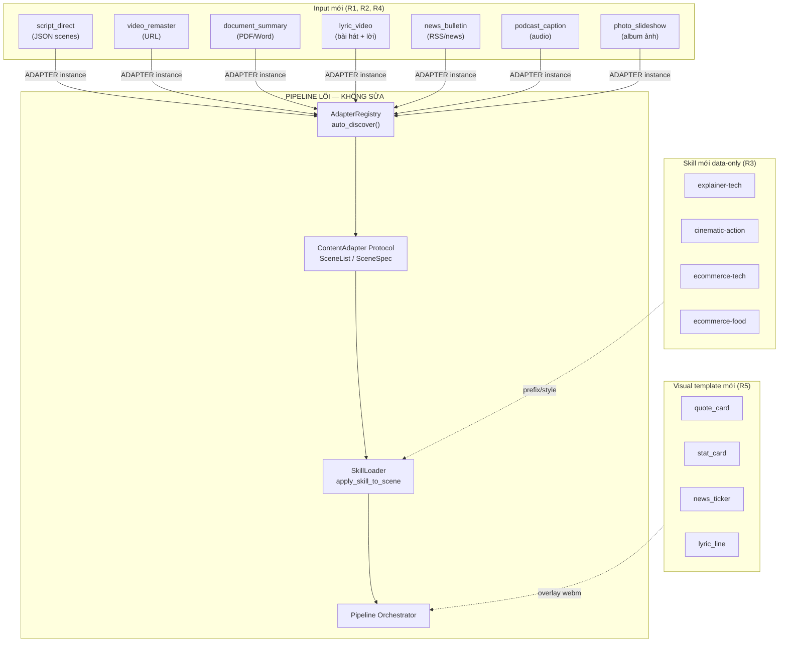
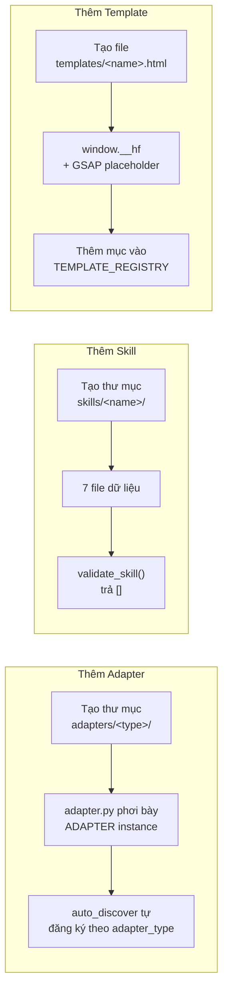
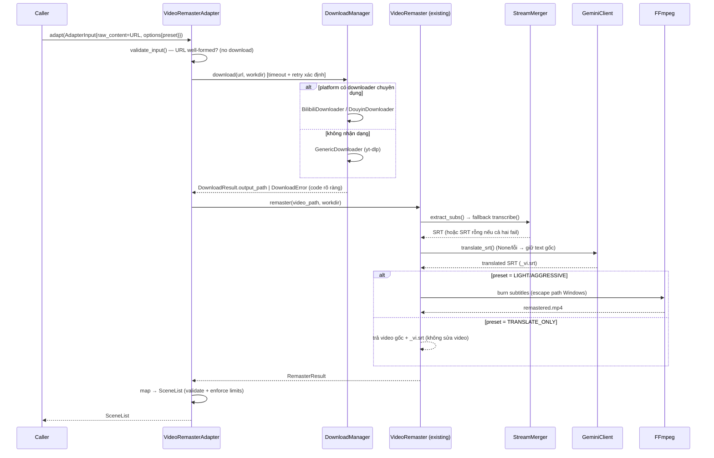

# Design Document — content-expansion

## Overview

`content-expansion` mở rộng ba trục tính năng trực giao của AIFlow — **Adapter** (loại input), **Skill** (phong cách), và **Visual Template** (lớp overlay) — mà KHÔNG sửa code lõi của pipeline. Toàn bộ thiết kế dựa trên các convention đã tồn tại và được xác minh qua đọc code:

- **Adapter auto-discovery**: `AdapterRegistry.auto_discover("server.content.adapters")` quét mọi sub-package, import `<pkg>.adapter`, và đăng ký module-level `ADAPTER` (instance) theo `adapter_type`. Thêm adapter = thêm một thư mục mới + `adapter.py` phơi bày `ADAPTER`. Không đụng `registry.py`.
- **Skill data-only**: `SkillLoader` đọc `skills/<name>/` gồm 7 file. `validate_skill()` trả list lỗi (rỗng = hợp lệ). Thêm skill = thêm một thư mục dữ liệu. Không đụng `skill_loader.py`.
- **Visual template**: `TEMPLATE_REGISTRY` (dict tên → `HfTemplateMetadata`) + file HTML phơi bày `window.__hf`. `PlaywrightRenderer` + `validate_hf_contract` kiểm tra hợp đồng. Thêm template = thêm file HTML + một mục registry.

Tính năng gồm 7 nhóm công việc tương ứng 7 Requirement:

1. **R1** — Hoàn thiện `script_direct` (pass-through adapter): nhận JSON `{scenes: [...]}`, validate theo hợp đồng input, trả `SceneList`.
2. **R2** — Wrap `VideoRemaster` đã có thành `video_remaster` ContentAdapter (mặt registry/interface).
3. **R3** — Thêm 4 skill data-only mới (`explainer-tech`, `cinematic-action`, `ecommerce-tech`, `ecommerce-food`).
4. **R4** — Thêm 5 adapter input mới (`document_summary`, `lyric_video`, `news_bulletin`, `podcast_caption`, `photo_slideshow`).
5. **R5** — Thêm 4 visual template mới (`quote_card`, `stat_card`, `news_ticker`, `lyric_line`).
6. **R6** — Ràng buộc chung & bảo toàn pipeline lõi (auto-discovery, Max_Scenes=50, Max_Duration=600, Veo3 clip=8s).
7. **R7** — Sửa & xác minh luồng `video_remaster` URL→video end-to-end (download → phụ đề → dịch → burn) cho preset `LIGHT`/`TRANSLATE_ONLY`; `AGGRESSIVE` hoãn nhưng phải hành xử dự đoán được.

Nguyên tắc xuyên suốt: **tái sử dụng, không nhân bản**. `video_remaster` adapter bọc `VideoRemaster` + `DownloadManager` hiện hữu. Mọi adapter mới dùng chung helper `SceneList.validate()`, `apply_skill_to_scene`, `estimate_scene_duration`, và một helper giới hạn pipeline mới dùng chung (shared limit guard).

### Nghiên cứu & phát hiện chính (đọc code)

- **`SceneList.validate()`** chỉ kiểm tra: `scenes` không rỗng, `order` liên tục từ 0, `duration ∈ [3, 30]`. Nó KHÔNG kiểm tra Max_Scenes (50) hay Max_Duration (600). Vì vậy R4.9/R6.2/R6.3 phải được enforce **trong adapter** trước khi trả về (không thể dựa vào `validate()`). Đây là một shared concern → tách thành helper dùng chung `enforce_pipeline_limits()`.
- **Giới hạn cấu hình** nằm ở `Settings.max_scenes_per_project = 50` và `max_video_duration_sec = 600` (`server/config.py`). Adapter hiện tại không nhận `Settings`; chúng dùng hằng số cục bộ. Để tránh phải sửa core/đổi chữ ký, helper giới hạn sẽ nhận giá trị qua tham số với default 50/600, đọc từ `Settings` khi có.
- **`AdapterError`** có `code`, `message`, `details`. Các code đã dùng: `ADAPTER_INVALID_INPUT`, `ADAPTER_INVALID_OUTPUT`, `ADAPTER_NOT_FOUND`, `ADAPTER_MISSING_TYPE`, `ADAPTER_FETCH_ERROR`. Adapter mới tái dùng các code này; `video_remaster` thêm code phản ánh lỗi tải (xem Data Models).
- **`DownloadManager.download()`** luôn dispatch: platform có downloader chuyên dụng → dùng nó; ngược lại → `GenericDownloader` (yt-dlp). Việc "không nhận dạng platform" KHÔNG chặn tải (khớp R2.5/R2.9). `GenericDownloader` đã có timeout 600s + raise `DownloadError` có `code` (`DOWNLOAD_TIMEOUT`, `YTDLP_ERROR`, …) nhưng KHÔNG có retry. R7.10 yêu cầu retry xác định → thêm một lớp retry mỏng trong adapter (không sửa downloader core).
- **`VideoRemaster.remaster(video_path, output_dir)`** nhận **file video đã tải** (không tự tải). Nó: lấy phụ đề (`extract_subs` → fallback `transcribe`) → dịch (`translate_srt` qua Gemini, fallback giữ text gốc) → áp preset. Vì vậy adapter phải tự gọi `DownloadManager.download()` TRƯỚC, rồi truyền `output_path` cho `VideoRemaster`. Đây chính là "lỗ hổng" R7: chuỗi download→remaster chưa được nối thành một luồng adapter chạy thật.
- **Anti-bot signing** (`wbi.py`, `a_bogus.py`) là STUB — `sign()` trả params không đổi, `get_wbi_keys()` trả `("", "")`. Tải URL Bilibili/Douyin thật có thể bị từ chối. R7.7/R7.9 thừa nhận điều này: phát lỗi rõ ràng + cho phép hoãn live verification, xác minh phần còn lại bằng file video cục bộ.
- **`_escape_srt_path_for_ffmpeg()`** đã xử lý escape `\` và `:` ổ đĩa Windows (khớp R7.8). Đã có test. Thiết kế giữ nguyên, chỉ xác minh.
- **PBT library**: dự án CHƯA có `hypothesis` trong `pyproject.toml`. Phần logic thuần (parse `script_direct`, enforce limits) là property-friendly → thiết kế bổ sung `hypothesis` vào `dev` extras và viết property tests cho các phần đó. Các phần I/O (download, ffmpeg burn, playwright render, skill data) dùng unit/integration/smoke test.
- **Test runner**: `pytest` + `pytest-asyncio` (`asyncio_mode = "auto"`). Python ≥ 3.12. Mọi test adapter hiện có theo pattern: tạo `AdapterRegistry()` mới + `auto_discover` + assert `adapter_type` xuất hiện.

## Architecture

### Sơ đồ tổng thể — ba trục mở rộng quanh pipeline lõi bất biến



### Quy ước mở rộng không-đụng-core



### Luồng `video_remaster` URL→video end-to-end (R2 + R7)



### Vị trí file (mọi đường dẫn mới)

```
app/
├── server/content/adapters/
│   ├── script_direct/
│   │   ├── __init__.py            (đã có, rỗng)
│   │   ├── adapter.py             [MỚI] ScriptDirectAdapter + ADAPTER
│   │   └── schema.py              [MỚI] Pydantic models cho hợp đồng input
│   ├── video_remaster/
│   │   ├── __init__.py            [MỚI]
│   │   └── adapter.py             [MỚI] VideoRemasterAdapter + ADAPTER (bọc VideoRemaster)
│   ├── document_summary/          [MỚI] adapter.py (+ extractor.py)
│   ├── lyric_video/               [MỚI] adapter.py (+ parser lời/.lrc)
│   ├── news_bulletin/             [MỚI] adapter.py (+ feed parser)
│   ├── podcast_caption/           [MỚI] adapter.py (transcribe → caption scenes)
│   └── photo_slideshow/           [MỚI] adapter.py (album ảnh → slideshow)
├── server/content/
│   └── pipeline_limits.py         [MỚI] enforce_pipeline_limits() shared helper
├── server/render/visual_layer/templates/
│   ├── quote_card.html            [MỚI]
│   ├── stat_card.html             [MỚI]
│   ├── news_ticker.html           [MỚI]
│   └── lyric_line.html            [MỚI]
├── server/render/visual_layer/template_registry.py   [SỬA: thêm 4 mục]
├── skills/
│   ├── explainer-tech/            [MỚI] 7 file
│   ├── cinematic-action/          [MỚI] 7 file
│   ├── ecommerce-tech/            [MỚI] 7 file
│   └── ecommerce-food/            [MỚI] 7 file
└── server/tests/                  [MỚI test files cho từng phần]
```

> **Lưu ý bảo toàn core (R6.1)**: `template_registry.py` được sửa nhưng đây KHÔNG phải code lõi của Adapter_Registry — nó là registry tĩnh của visual layer mà spec 05/08 dự kiến sẽ bổ sung mục khi thêm template. Việc thêm mục vào `TEMPLATE_REGISTRY` là convention chính thức (R5.5), không phải sửa logic lõi. Adapter_Registry (`server/content/registry.py`) và `SkillLoader` (`server/content/skill_loader.py`) KHÔNG bị chỉnh sửa.

## Components and Interfaces

Mọi adapter mới thỏa `ContentAdapter` Protocol (`server/content/base.py`): class attribute `adapter_type: str`, `async def adapt(self, input: AdapterInput) -> SceneList`, `def validate_input(self, input: AdapterInput) -> list[str]`. Mọi adapter phơi bày module-level `ADAPTER` (instance) — và theo convention dự án, cũng `ADAPTER_CLASS` (class) — trong `adapter.py`.

### Component 0: Shared pipeline-limit helper (`server/content/pipeline_limits.py`) — MỚI

Vì `SceneList.validate()` không kiểm tra Max_Scenes/Max_Duration, mọi adapter (mới + wrapped) cần một guard dùng chung để thỏa R4.9, R6.2, R6.3. Tách thành helper để tránh lặp logic và để `video_remaster` cùng dùng.

```python
# server/content/pipeline_limits.py
from server.content.base import AdapterError, SceneList

DEFAULT_MAX_SCENES = 50          # Max_Scenes
DEFAULT_MAX_DURATION_SEC = 600.0 # Max_Duration

def enforce_pipeline_limits(
    scene_list: SceneList,
    *,
    max_scenes: int = DEFAULT_MAX_SCENES,
    max_duration_sec: float = DEFAULT_MAX_DURATION_SEC,
) -> None:
    """Raise AdapterError(code='ADAPTER_INVALID_OUTPUT') nếu vượt giới hạn.

    Gọi SAU SceneList.validate() và TRƯỚC khi adapter trả về.
    Tổng thời lượng = sum(scene.duration for scene in scenes).
    """
    n = len(scene_list.scenes)
    if n > max_scenes:
        raise AdapterError(
            "ADAPTER_INVALID_OUTPUT",
            f"Scene count {n} exceeds Max_Scenes ({max_scenes})",
            details={"scene_count": n, "max_scenes": max_scenes},
        )
    total = sum(s.duration for s in scene_list.scenes)
    if total > max_duration_sec:
        raise AdapterError(
            "ADAPTER_INVALID_OUTPUT",
            f"Total duration {total:.1f}s exceeds Max_Duration ({max_duration_sec}s)",
            details={"total_duration_sec": total, "max_duration_sec": max_duration_sec},
        )
```

Giá trị default 50/600 phản ánh `Settings.max_scenes_per_project` / `max_video_duration_sec`. Adapter có thể đọc `Settings` và truyền giá trị thực tế qua tham số nếu cần, nhưng default đảm bảo guard hoạt động kể cả khi không có `Settings`.

### Component 1: `ScriptDirectAdapter` (R1)

`server/content/adapters/script_direct/adapter.py` + `schema.py`. Pass-through: parse JSON, validate hợp đồng input (mục R1.15–R1.19), build `SceneSpec`, áp skill nếu có, validate output + enforce limits.

**Hợp đồng input có thẩm quyền** (R1.15–R1.19, mirror `input_schema` spec 05):
- Top-level: object, bắt buộc mảng `scenes` (≥ 1 phần tử).
- Mỗi scene: bắt buộc `narration: string`, `visual_prompt: string`.
- Tùy chọn: `duration_sec: number`, `asset_ids: array`.
- Field thừa ngoài 4 field trên: **bỏ qua, không fail** (R1.19) → Pydantic `extra="ignore"`.

```python
# schema.py
from pydantic import BaseModel, Field, field_validator

class ScriptDirectScene(BaseModel):
    model_config = {"extra": "ignore"}  # R1.19 — bỏ qua field thừa
    narration: str
    visual_prompt: str
    duration_sec: float | None = None   # R1.17 — number nếu có
    asset_ids: list | None = None       # R1.18 — array nếu có

    @field_validator("narration", "visual_prompt")
    @classmethod
    def not_blank(cls, v: str) -> str:
        if not isinstance(v, str) or not v.strip():
            raise ValueError("must be a non-empty string")
        return v

class ScriptDirectInput(BaseModel):
    model_config = {"extra": "ignore"}
    scenes: list[ScriptDirectScene] = Field(..., min_length=1)
```

**`adapt()` thứ tự xử lý (CHÍNH XÁC theo R1.6, R1.10)**:
1. `validate_input()` → nếu lỗi, raise `AdapterError("ADAPTER_INVALID_INPUT", ...)`.
2. Parse JSON (lỗi parse → `ADAPTER_INVALID_INPUT`, R1.7).
3. Thiếu/empty `scenes` → `ADAPTER_INVALID_INPUT` (R1.8).
4. Mỗi scene thiếu `narration`/`visual_prompt` → `ADAPTER_INVALID_INPUT` + chỉ số phần tử trong `details` (R1.9).
5. **Validate `duration` của TẤT CẢ scene TRƯỚC** (mỗi scene: `duration_sec` mặc định 8.0 nếu thiếu — R1.5; phải ∈ [3, 30] — R1.6). Nếu BẤT KỲ scene nào có duration ngoài [3, 30] (gồm 0.0) → raise `AdapterError` ngay tại bước này, TRƯỚC khi gán `order` cho bất kỳ SceneSpec nào (R1.10).
6. Chỉ sau khi toàn bộ duration hợp lệ → gán `order` liên tục từ 0 theo thứ tự input (R1.6).
7. Build `SceneSpec(order, prompt=visual_prompt, duration, narration)`.
8. Áp skill nếu `input.skill_name` (R1.14) — qua `apply_skill_to_scene`.
9. `SceneList.validate()` → nếu fail → `ADAPTER_INVALID_OUTPUT` (R1.13).
10. `enforce_pipeline_limits()` (R6.2/R6.3).

**`validate_input()`** (R1.11/R1.12): cheap, không gọi API ngoài. Trả `[]` nếu hợp lệ; ngược lại list lỗi người-đọc-được (JSON parse error, thiếu `scenes`, scene thiếu field, kiểu sai…). Tái dùng `ScriptDirectInput.model_validate` bọc trong try/except để gom lỗi (giống `validate_storyboard`).

### Component 2: `VideoRemasterAdapter` (R2 + R7)

`server/content/adapters/video_remaster/adapter.py`. Bọc `VideoRemaster` + `DownloadManager` hiện hữu — KHÔNG viết lại logic (R2.4, R6.7).

```python
class VideoRemasterAdapter:
    adapter_type = "video_remaster"

    async def adapt(self, input: AdapterInput) -> SceneList:
        # 1. validate_input → ADAPTER_INVALID_INPUT nếu URL dị dạng
        # 2. Resolve preset từ options (mặc định 'light' — R2.11/R2.12)
        # 3. workdir = options['workdir'] hoặc tmp dir
        # 4. download_with_retry(url, workdir)  ← timeout + retry xác định (R7.10)
        #       → DownloadError → AdapterError(code phản ánh lỗi tải, R2.10/R7.7)
        # 5. cfg = RemasterConfig(preset, source_language, target_language, gemini_client)
        #       gemini_client lấy từ options (None → giữ text gốc, R7.4)
        # 6. VideoRemaster(cfg).remaster(video_path, workdir) → RemasterResult (R2.6/R7.1/R7.2)
        # 7. map RemasterResult → SceneList (xem Data Models) → validate + enforce limits (R2.7)
        #       SceneList.metadata gắn marker passthrough (xem "Hợp đồng passthrough" bên dưới)
        ...

    def validate_input(self, input: AdapterInput) -> list[str]:
        # URL well-formed? (urllib.parse: scheme http/https + netloc)
        # KHÔNG tải video (R2.8). KHÔNG gọi API ngoài.
        ...
```

**Phân định platform (R2.5/R2.9)**: adapter KHÔNG tự quyết định platform. Nó truyền URL cho `DownloadManager.download()`, vốn auto-detect: platform nhận dạng → downloader chuyên dụng; không nhận dạng → `GenericDownloader`. URL hợp lệ luôn được thử tải; "không nhận dạng platform" chỉ chọn downloader, không chặn tải.

**Retry xác định (R7.10)** — `download_with_retry()` là helper mỏng trong adapter (không sửa downloader core):

```python
import time

_RETRY_SLEEP_SEC = 1.0  # sleep cố định giữa các lần thử (xem ghi chú backoff)

def download_with_retry(manager, url, workdir, *, retries=2, sleep_sec=_RETRY_SLEEP_SEC, ...):
    last_err = None
    for attempt in range(retries + 1):   # tổng = 1 + retries lần thử
        try:
            return manager.download(url, workdir, cookies=...)
        except DownloadError as e:
            last_err = e
            if attempt < retries:
                time.sleep(sleep_sec)     # sleep cố định trước khi thử lại
                continue
    raise AdapterError("ADAPTER_DOWNLOAD_FAILED",
                       f"Download failed after {retries+1} attempts: {last_err.reason}",
                       details={"url": url, "code": last_err.code})
```

`GenericDownloader` đã có timeout 600s nội tại; helper bọc thêm retry cố định nhỏ. Khi cạn retry → `AdapterError` với message rõ ràng (R7.7) thay vì treo (R7.10) hoặc output rỗng âm thầm.

> **Quyết định thiết kế — sleep cố định thay vì thư viện retry**: Bản pseudocode ban đầu retry liên tục KHÔNG có khoảng nghỉ (no backoff/jitter), có thể "nã" một server đang rate-limit và làm tình trạng tệ hơn. Hai lựa chọn: (a) thêm dependency `tenacity` để có exponential backoff + jitter chuẩn — mạnh hơn nhưng phát sinh một phụ thuộc mới cho một nhu cầu rất nhỏ; (b) thêm một khoảng `time.sleep` cố định nhỏ (0.5–1s) giữa các lần thử — đủ để giảm áp lực lên server bị rate-limit mà KHÔNG thêm dependency. **Chọn (b) — sleep cố định** để giữ cây phụ thuộc gọn (retry chỉ chạy tối đa `retries` lần, biên độ nhỏ nên không cần backoff phức tạp). Nếu sau này cần backoff/jitter thực thụ thì nâng cấp sang `tenacity` là đường nâng cấp rõ ràng. `sleep_sec` để tham số hóa được nhằm test (truyền `0` trong unit/property test để không làm chậm — Property 12 không phụ thuộc thời gian nghỉ).

**Preset (R2.11/R2.12)**: `options["preset"]` ∈ {`light`, `aggressive`, `translate_only`} → map sang `RemasterPreset`. Thiếu → `light`. `AGGRESSIVE` chuyển thẳng cho `VideoRemaster` — vốn đã log cảnh báo "TTS not yet implemented" và fallback `LIGHT` (R7.5).

**`VideoRemaster` sửa cho R7**: Logic cốt lõi (`remaster()`) ĐÃ đúng (extract→fallback transcribe→translate→burn, escape path Windows). R7 chủ yếu là **nối** download vào luồng (làm ở adapter) + **xác minh chạy thật** (làm ở task verification). Không cần sửa `VideoRemaster.remaster()` trừ khi verification phát hiện lỗi. `AGGRESSIVE` giữ nguyên hành vi fallback có cảnh báo (R7.5).

**Hợp đồng passthrough — `video_remaster` KHÔNG vào pipeline Veo3 (giả định thiết kế, option a)**: Output của `video_remaster` là một file video remastered ĐÃ HOÀN CHỈNH; nó không phải tập hợp các "scene" để pipeline orchestrator sinh clip Veo3. Nếu orchestrator lặp qua `SceneList.scenes` để gọi Veo3, nó sẽ SAI khi cố sinh một clip từ `prompt="Remastered video..."` (1 scene hình thức) — đây là rò rỉ trừu tượng cần chặn tường minh.

Giải pháp (chọn **option a — marker trong metadata**, không cần sửa core): adapter đặt cờ trong `SceneList.metadata` để orchestrator kiểm tra và BỎ QUA bước sinh Veo3 cho nguồn này:

```python
metadata = {
    "passthrough": True,                 # orchestrator: KHÔNG sinh Veo3 từ scenes
    "source_kind": "remastered_video",   # phân loại nguồn passthrough
    "output_path": str(result.output_path),  # file video thật để dùng trực tiếp
    ...
}
```

Quy ước: **nếu `metadata.get("passthrough") is True`, orchestrator phải dùng `metadata["output_path"]` làm sản phẩm video và KHÔNG iterate `scenes` để sinh clip Veo3.** Scene đơn chỉ tồn tại để thỏa Protocol + `SceneList.validate()` (R2.7). Marker này là convention thuần dữ liệu (chỉ thêm khóa vào dict metadata sẵn có), KHÔNG sửa `SceneList`/`SceneSpec`/orchestrator core; nếu orchestrator hiện chưa đọc cờ này thì đây là điểm tích hợp cần kiểm khi nối luồng (ghi nhận như một assumption rõ ràng). Mapping chi tiết xem phần Data Models (RemasterResult → SceneList).

### Component 3: Skill mới data-only (R3)

4 thư mục mới dưới `skills/`, mỗi thư mục đủ 7 file (`manifest.yaml`, `style.json`, `prefix.md`, `character.md`, `scene.md`, `motion.md`, `voice.yaml`). KHÔNG file Python (R3.2). Tất cả `extends: _base`.

| Skill | `adapter_type` | `supported_adapters` | Ghi chú |
|-------|----------------|----------------------|---------|
| `explainer-tech` | `narrative_script` | narrative_script, blog_article, document_summary, script_direct | Phong cách explainer công nghệ |
| `cinematic-action` | `narrative_script` | narrative_script, storyboard_manual, script_direct | Hành động điện ảnh, camera động |
| `ecommerce-tech` | `ecommerce_product` (R3.9) | ecommerce_product, storyboard_manual, script_direct | Biến thể tech của e-commerce |
| `ecommerce-food` | `ecommerce_product` (R3.9) | ecommerce_product, storyboard_manual, script_direct | Biến thể food của e-commerce |

`manifest.yaml` mỗi skill khai báo bắt buộc `name`, `version`, `adapter_type` (R3.5), `extends: _base` (R3.6), `style_ref: style.json`, `voice`, và `supported_adapters` (R3.8). `ecommerce-tech`/`ecommerce-food` đặt `adapter_type: ecommerce_product` (R3.9).

> **Adapter mục tiêu đã XÁC NHẬN tồn tại (không giả định)**: `adapter_type = "ecommerce_product"` mà hai skill `ecommerce-tech`/`ecommerce-food` nhắm tới là một adapter **đã tồn tại và đăng ký** trong codebase — xác minh qua đọc `server/content/adapters/ecommerce_product/adapter.py` (`class EcommerceProductAdapter` có `adapter_type: str = "ecommerce_product"`, phơi bày module-level `ADAPTER`/`ADAPTER_CLASS`). Vì vậy R3.9 KHÔNG tạo phụ thuộc vào một adapter giả định: skill chỉ là dữ liệu phong cách áp lên adapter có thật. (Tham chiếu thêm: requirements liệt kê `ecommerce_product` trong nhóm "Adapter đăng ký & hoạt động".)

`style.json` mỗi skill là JSON object hợp lệ chứa tối thiểu các khóa mà skill hiện có dùng (R3.11): `art_style`, `lighting`, `color_palette`, `camera_rules`, `negative_prompts`, `aspect_ratio` — đúng tập khóa của `ecommerce-fashion`/`kdrama-romance`. `validate_style_json` (đã đọc) chỉ bắt buộc `art_style`/`lighting`/`color_palette` nhưng R3.11 yêu cầu đủ 6 khóa → ta cung cấp đủ.

`prefix.md` ≥ 20 từ nội dung thực chất (R3.10). `character.md`/`scene.md`/`motion.md` không rỗng, có nội dung template thực chất (R3.12). `voice.yaml` khai báo `primary_backend` + `primary_voice` (R3.13) theo cấu trúc `voice_profile` của skill hiện có.

Mục tiêu nghiệm thu: `SkillLoader.validate_skill(<name>)` trả `[]` (R3.4), `SkillLoader.load(<name>)` trả `LoadedSkill` với `style` hợp lệ (R3.7) — không sửa code `SkillLoader` (R6.5).

### Component 4: Adapter input mới (R4) — cả 5 bắt buộc

Mỗi adapter là một thư mục dưới `server/content/adapters/`, `adapter.py` phơi bày `ADAPTER`. Tất cả thỏa Protocol (R4.4), trả `SceneList` hợp lệ (R4.5), enforce limits (R4.9), đăng ký thuần qua auto-discovery (R4.3/R4.7/R4.8).

**Nguyên tắc `validate_input` của R4.6**: KHÔNG gọi API ngoài (network/LLM), KHÔNG dựa cache từ API trước. ĐƯỢC PHÉP gọi thư viện cục bộ (đọc header file, parse cấu trúc PDF bằng `pypdf`, kiểm định dạng) và kiểm tra file tồn tại.

| Adapter | `adapter_type` | Input (`raw_content`/`assets`) | Chiến lược `adapt()` | Thư viện cục bộ |
|---------|----------------|-------------------------------|----------------------|-----------------|
| `document_summary` | `document_summary` | `assets["document"]` = .pdf/.docx | Trích text cục bộ → chunk → scenes (tóm tắt qua LLM nếu có gemini_client; fallback chunk theo câu) | `pypdf`, `python-docx` |
| `lyric_video` | `lyric_video` | `raw_content` = lời/.lrc; `assets["audio"]` tùy chọn | Parse lời (LRC có timestamp → scene theo dòng; plain → chunk) → mỗi đoạn lời = 1 scene | parser nội bộ (regex LRC) |
| `news_bulletin` | `news_bulletin` | `raw_content` = RSS/Atom XML hoặc URL feed | Parse feed cục bộ → mỗi item = 1 scene bản tin (headline + summary) | `feedparser` hoặc `xml.etree` |
| `podcast_caption` | `podcast_caption` | `assets["audio"]` = file audio | Transcribe (Whisper qua `transcribe_audio`/StreamMerger) → SRT → mỗi segment = 1 scene phụ đề | dùng lại `server.audio.transcribe` |
| `photo_slideshow` | `photo_slideshow` | `assets` = nhiều ảnh (hoặc `raw_content` JSON list path) | Mỗi ảnh = 1 scene (start_image = ảnh) + narration tùy chọn | đọc header ảnh cục bộ (Pillow nếu có) |

Mỗi adapter dùng `estimate_scene_duration` (đã có) để gán duration từ narration, hoặc 8.0 mặc định (R6.4). Áp skill nếu `skill_name`. Sau khi build → `SceneList.validate()` → `enforce_pipeline_limits()`. Khi số scene/tổng duration vượt giới hạn → `ADAPTER_INVALID_OUTPUT` (R4.9).

**Hành vi biên đã chốt (làm rõ điểm mơ hồ)**:

- **`document_summary` — fallback khi LLM lỗi giữa chừng là PER-CHUNK, không all-or-nothing**: Khi `gemini_client` khả dụng, adapter tóm tắt từng chunk qua LLM. Nếu một lời gọi LLM thất bại giữa chừng (timeout/partial error) cho MỘT chunk, adapter CHỈ fallback chunk đó về sentence-chunking (cắt câu cục bộ, không LLM); các chunk đã tóm tắt thành công vẫn được giữ. **Chọn per-chunk fallback** vì an toàn hơn — không mất toàn bộ công việc khi một chunk lỗi, và kết quả vẫn là một `SceneList` hoàn chỉnh. (Khác biệt rõ với `gemini_client is None` ngay từ đầu → toàn bộ dùng sentence-chunking.) Hệ quả test: cần một test mô phỏng LLM lỗi ở một chunk con và assert các chunk khác vẫn được tóm tắt.

- **`photo_slideshow` — ảnh hỏng/không đọc được xử lý STRICT (fail-fast) cho MVP**: Khi một trong N ảnh bị hỏng hoặc không đọc được header, adapter chọn **strict**: `validate_input` đọc header từng ảnh cục bộ (Pillow nếu có) và trả lỗi mô tả (kèm path/chỉ số ảnh lỗi) nếu BẤT KỲ ảnh nào không đọc được; `adapt` do đó fail-fast với `ADAPTER_INVALID_INPUT` thay vì âm thầm bỏ ảnh. Lý do chọn strict cho MVP: slideshow có thứ tự/đếm ảnh xác định, bỏ âm thầm một ảnh sẽ tạo output sai lệch khó phát hiện; người dùng nên sửa input. (Hành vi permissive "skip + log warning" được ghi nhận như một nâng cấp khả dĩ sau MVP, không thuộc phạm vi này.)

- **`news_bulletin` — giới hạn của `validate_input` với feed dạng URL**: `raw_content` có thể là RSS/Atom XML thô HOẶC một URL feed. Vì `validate_input` KHÔNG được gọi network (R4.6), nó chỉ kiểm được **tính well-formed**: với XML thô → parse cục bộ để xác nhận cấu trúc feed; với một URL → chỉ kiểm URL đúng cấu trúc (scheme http/https + netloc). **Trường hợp "URL là một trang HTML hợp lệ nhưng KHÔNG phải RSS/Atom feed" CHỈ phát hiện được trong `adapt()`** (sau khi fetch thật) và sẽ raise `ADAPTER_FETCH_ERROR`; `validate_input` không thể phát hiện điều này vì không được phép gọi mạng. Tài liệu hóa rõ để không kỳ vọng `validate_input` bắt được lỗi "URL không phải feed".

**Phụ thuộc mới (optional extras)**: `pypdf`, `python-docx`, `feedparser`, `Pillow` thêm vào một extras nhóm (vd `[project.optional-dependencies].content`). Adapter import lazy + raise `AdapterError` rõ ràng nếu thư viện thiếu (giống pattern `transcribe_video` với faster-whisper).

### Component 5: Visual template mới (R5)

4 file HTML trong `server/render/visual_layer/templates/` + 4 mục trong `TEMPLATE_REGISTRY`.

| Template | Variables (`{{KEY}}`) | duration | Animation GSAP gắn timeline |
|----------|----------------------|----------|------------------------------|
| `quote_card` | `QUOTE`, `AUTHOR` | 5.0 | fade/scale quote + slide author |
| `stat_card` | `STAT_VALUE`, `STAT_LABEL` | 4.0 | count-up/scale số liệu theo timeline |
| `news_ticker` | `HEADLINE`, `SOURCE` | 6.0 | ticker trượt ngang (x) theo timeline |
| `lyric_line` | `LINE`, `NEXT_LINE` | 4.0 | dòng lời fade-in/out, highlight |

Mỗi template (R5.2–R5.9):
- File HTML trong `templates/` (R5.2).
- Nạp GSAP qua `{{__VENDOR_GSAP__}}` (R5.7), KHÔNG CDN.
- Phơi bày `window.__hf = { duration: <số dương hữu hạn>, seek(t){ tl.seek(t); } }` (R5.3) với `tl = gsap.timeline({ paused: true })`.
- Tối thiểu một animation GSAP gắn timeline để `seek(t)` đổi frame theo `t` (R5.9).
- `document.body.style.background = 'transparent'` (alpha), kích thước 1080×1920 — đồng nhất template hiện có.
- Mọi biến `{{KEY}}` trong HTML phải khớp danh sách `variables` trong registry (R5.8).

**`TEMPLATE_REGISTRY` (R5.5)** — thêm 4 mục `HfTemplateMetadata(name, duration, width=1080, height=1920, variables=[...])`. `get_template_path(<name>)` trả path tồn tại trên đĩa (R5.6). `validate_hf_contract` trên template đã render → `passed=True` (R5.4).

**Bộ template bắt buộc (R5.10)**: validation của bộ template phải FAIL nếu thiếu bất kỳ template trong `{quote_card, stat_card, news_ticker, lyric_line}`, và KHÔNG được pass khi bộ rỗng. **Đây là một TEST (pytest), không phải kiểm tra runtime lúc import**: việc kiểm "đủ bộ bắt buộc" được thực thi bằng một test trong suite (kiểm cả 4 tên đều có mặt trong `TEMPLATE_REGISTRY` và `get_template_path` trả file tồn tại trên đĩa), KHÔNG phải một validation chạy lúc import/đăng ký registry. Lý do: ép buộc "bộ bắt buộc" tại import-time sẽ khiến `template_registry` (vốn là registry tĩnh dùng chung) ném lỗi nếu một template chưa được thêm, làm vỡ mọi import phụ thuộc registry một cách giòn (fragile) — trong khi mục tiêu R5.10 là một cổng kiểm thử (acceptance gate), phù hợp đặt ở tầng test.

### Component 6: Auto-discovery & registration (R6)

Không có component code mới — đây là ràng buộc kiến trúc. Mọi adapter ở Component 1/2/4 tuân thủ:
- Đăng ký chỉ qua convention `adapter_type` + module-level `ADAPTER` (R6.1).
- Không sửa `server/content/registry.py` hay `SkillLoader`.
- enforce Max_Scenes/Max_Duration qua `enforce_pipeline_limits` (R6.2/R6.3).
- duration mặc định = 8.0 khi không tường minh (R6.4).
- `video_remaster` tái dùng crawler hiện có (R6.7).

Điểm gọi `auto_discover("server.content.adapters")` đã tồn tại trong pipeline; adapter mới tự xuất hiện sau khi thêm thư mục. R4.8 lưu ý: kể cả khi core bị sửa, registry vẫn đăng ký adapter mới qua convention — ràng buộc là adapter KHÔNG ĐÒI HỎI sửa core.

## Data Models

Tính năng tái dùng tối đa các dataclass lõi đã có — KHÔNG định nghĩa lại `SceneList`/`SceneSpec`/`AdapterInput`. Dưới đây là các model mới và cách map dữ liệu.

### Tái dùng (không sửa) — từ `server/content/base.py`

- **`AdapterInput`**: `source_type`, `raw_content`, `assets: dict[str, Path]`, `skill_name`, `options: dict`.
- **`SceneSpec`**: `order`, `prompt`, `duration=8.0`, `start_image`, `location_hint`, `narration`.
- **`SceneList`**: `project_id`, `scenes`, `style_ref`, `voice`, `metadata`; `validate() -> (ok, errors)`.
- **`AdapterError`**: `code`, `message`, `details`.

### `script_direct` models (mới — `schema.py`)

`ScriptDirectScene` và `ScriptDirectInput` (đã nêu ở Components). Ánh xạ input→SceneSpec:

| Field input | SceneSpec | Quy tắc |
|-------------|-----------|---------|
| `visual_prompt` | `prompt` | bắt buộc, non-blank |
| `narration` | `narration` | bắt buộc, non-blank |
| `duration_sec` | `duration` | mặc định 8.0 nếu thiếu (R1.5); phải ∈ [3,30] (R1.6/R1.10) |
| (vị trí trong mảng) | `order` | gán liên tục từ 0 SAU khi mọi duration hợp lệ (R1.6) |
| `asset_ids` | `metadata`/`start_image` | giữ trong metadata; không bắt buộc map |

### `video_remaster` — RemasterResult → SceneList

`VideoRemaster.remaster()` trả `RemasterResult(output_path, translated_srt, original_srt, preset)`. Adapter map sang `SceneList` 1 scene đại diện video remastered (video đã là sản phẩm cuối; pipeline coi đây là nguồn đã dựng):

```python
SceneList(
    project_id = options.get("project_id", "video_remaster"),
    scenes = [SceneSpec(
        order=0,
        prompt=f"Remastered video with Vietnamese subtitles ({preset.value})",
        # clamp CHỈ để qua SceneList.validate() (yêu cầu duration ∈ [3,30]);
        # KHÔNG phản ánh độ dài thật của video — độ dài thật nằm ở metadata.
        duration=clamp(probe_duration or 8.0, 3.0, 30.0),  # ∈ [3,30] để qua validate()
        start_image=None,
        narration=None,
    )],
    voice = options.get("voice"),
    metadata = {
        "adapter": "video_remaster",
        "passthrough": True,                  # R-passthrough: orchestrator KHÔNG sinh Veo3 từ scenes
        "source_kind": "remastered_video",    # phân loại nguồn passthrough
        "preset": preset.value,
        "output_path": str(result.output_path),
        "translated_srt": str(result.translated_srt),
        "original_srt": str(result.original_srt) if result.original_srt else None,
        "source_url": url,
    },
)
```

> **Ghi chú thiết kế**: video remaster đã tạo file video hoàn chỉnh — nó không tự nhiên chia thành nhiều "scene Veo3". `SceneList` ở đây mang tính giao diện chuẩn để adapter tuân Protocol (R2.7); thông tin thật (đường dẫn video/SRT) nằm trong `metadata`. Marker `passthrough=True` + `source_kind="remastered_video"` báo orchestrator dùng `metadata["output_path"]` trực tiếp và BỎ QUA việc iterate `scenes` để sinh clip Veo3 (xem "Hợp đồng passthrough" ở Component 2) — nhờ vậy scene hình thức không bị hiểu nhầm thành một clip cần generate.
>
> **Về `duration` clamp**: `duration` được clamp vào [3,30] **chỉ** nhằm thỏa ràng buộc của `SceneList.validate()`; giá trị này KHÔNG biểu thị độ dài thật của video remastered (một video có thể dài hàng phút). Độ dài/đường dẫn thật của sản phẩm nằm trong `metadata` (`output_path`), không suy ra từ `scenes[0].duration`. Vì chỉ có một scene, tổng duration không thể vượt Max_Duration.

### `RemasterConfig` (tái dùng) + ánh xạ preset

| `options["preset"]` | `RemasterPreset` | Hành vi |
|---------------------|------------------|---------|
| `"light"` / thiếu | `LIGHT` | burn phụ đề đã dịch |
| `"translate_only"` | `TRANSLATE_ONLY` | chỉ dịch SRT, không sửa video |
| `"aggressive"` | `AGGRESSIVE` | fallback LIGHT + cảnh báo (hoãn — R7.5) |

### Error codes (AdapterError.code)

| Code | Khi nào | Requirement |
|------|---------|-------------|
| `ADAPTER_INVALID_INPUT` | JSON sai, thiếu field bắt buộc, duration ngoài [3,30], URL dị dạng | R1.7–R1.10, R2 input |
| `ADAPTER_INVALID_OUTPUT` | `SceneList.validate()` fail, vượt Max_Scenes/Max_Duration | R1.13, R4.9, R6.2/R6.3 |
| `ADAPTER_DOWNLOAD_FAILED` | tải video thất bại sau retry (bọc `DownloadError`) | R2.10, R7.7, R7.10 |
| `ADAPTER_FETCH_ERROR` | (tái dùng) fetch feed/article lỗi | R4 (news/document) |

`ADAPTER_DOWNLOAD_FAILED.details` chứa `{"url", "code"}` (code gốc từ `DownloadError`: `DOWNLOAD_TIMEOUT`/`YTDLP_ERROR`/`YTDLP_NOT_FOUND`…) để chẩn đoán lỗi tải/ký (R7.7).

### `HfTemplateMetadata` (tái dùng) — 4 mục mới

```python
"quote_card":  HfTemplateMetadata("quote_card", 5.0, 1080, 1920, ["QUOTE", "AUTHOR"]),
"stat_card":   HfTemplateMetadata("stat_card", 4.0, 1080, 1920, ["STAT_VALUE", "STAT_LABEL"]),
"news_ticker": HfTemplateMetadata("news_ticker", 6.0, 1080, 1920, ["HEADLINE", "SOURCE"]),
"lyric_line":  HfTemplateMetadata("lyric_line", 4.0, 1080, 1920, ["LINE", "NEXT_LINE"]),
```

### Skill data model (tái dùng `SkillManifest` + `style.json`)

`SkillManifest` (Pydantic, `extra="allow"`): `name`, `version`, `adapter_type` bắt buộc; `style_ref`, `voice`, `camera_lock`, `safety_level`, `options`, `extends` (extra). `style.json` theo `validate_style_json` + đủ 6 khóa R3.11. `voice.yaml` cấu trúc `voice_profile: {primary_backend, primary_voice, ...}`.

## Correctness Properties

*A property is a characteristic or behavior that should hold true across all valid executions of a system — essentially, a formal statement about what the system should do. Properties serve as the bridge between human-readable specifications and machine-verifiable correctness guarantees.*

Phần này áp dụng property-based testing (PBT) cho **các phần logic thuần** của tính năng: parse/map của `script_direct`, bất biến giới hạn pipeline dùng chung, fallback dịch SRT, escape đường dẫn Windows, và retry tải xác định. Các phần KHÔNG hợp PBT — render UI (template HTML/GSAP), điều phối I/O (download, ffmpeg burn, transcribe), dữ liệu skill, và xác minh live — được kiểm bằng example/integration/smoke test (xem Testing Strategy). Mỗi property dưới đây được suy ra từ prework và sẽ được hiện thực bằng MỘT property-based test (≥ 100 iteration).

### Property 1: Mapping bảo toàn — script_direct map đúng và đầy đủ

*For any* JSON `script_direct` hợp lệ (object có mảng `scenes` ≥ 1 phần tử, mỗi phần tử có `narration`/`visual_prompt` non-blank và `duration_sec` ∈ [3,30] khi có), `adapt()` trả về một `SceneList` mà: số `SceneSpec` bằng số phần tử input; với mỗi phần tử thứ `i`, `scenes[i].order == i`, `scenes[i].prompt` chứa `visual_prompt` gốc, `scenes[i].narration == narration` gốc, và `scenes[i].duration` bằng `duration_sec` khi có hoặc `8.0` khi thiếu.

**Validates: Requirements 1.4, 1.5, 1.6, 6.4**

### Property 2: JSON không hợp lệ bị từ chối

*For any* chuỗi `raw_content` không phải JSON hợp lệ, `adapt()` raise `AdapterError` với code `"ADAPTER_INVALID_INPUT"`.

**Validates: Requirements 1.7**

### Property 3: Thiếu field bắt buộc bị từ chối kèm chỉ số

*For any* JSON `script_direct` hợp lệ ban đầu mà sau đó bị xóa trường bắt buộc (`narration` hoặc `visual_prompt`) tại một phần tử chỉ số `i` bất kỳ (hoặc đặt sai kiểu non-string), `adapt()` raise `AdapterError` với code `"ADAPTER_INVALID_INPUT"` và `details` tham chiếu chỉ số phần tử lỗi `i`.

**Validates: Requirements 1.9, 1.16**

### Property 4: Duration được xác thực TRƯỚC khi gán order

*For any* JSON `script_direct` có ít nhất một phần tử với `duration_sec` ngoài khoảng [3,30] (bao gồm `0.0`), `adapt()` raise `AdapterError` ngay tại bước xác thực duration, và KHÔNG có `SceneSpec` nào được gán `order` (không có output bộ phận).

**Validates: Requirements 1.6, 1.10**

### Property 5: Áp skill thêm prefix vào mọi prompt

*For any* JSON `script_direct` hợp lệ và bất kỳ skill có prefix non-empty, khi `skill_name` được đặt, mọi `SceneSpec.prompt` trong `SceneList` kết quả đều chứa văn bản prefix của skill.

**Validates: Requirements 1.14**

### Property 6: Field thừa được bỏ qua, không làm fail

*For any* JSON `script_direct` hợp lệ được bổ sung các khóa tùy ý ngoài tập `{narration, visual_prompt, duration_sec, asset_ids}` tại mỗi phần tử scene, `adapt()` vẫn thành công và các khóa thừa không xuất hiện trong các trường lõi của `SceneSpec`.

**Validates: Requirements 1.19**

### Property 7: Bất biến giới hạn pipeline được enforce

*For any* `SceneList`, `enforce_pipeline_limits()` raise `AdapterError` với code `"ADAPTER_INVALID_OUTPUT"` khi và chỉ khi số scene vượt Max_Scenes (50) hoặc tổng thời lượng scene vượt Max_Duration (600s); ngược lại nó trả về không lỗi.

**Validates: Requirements 4.9, 6.2, 6.3**

### Property 8: `validate_input` từ chối input không hợp lệ mà không gọi API ngoài

*For any* `AdapterInput` không hợp lệ (với `script_direct` và với mỗi adapter input mới), `validate_input()` trả về một danh sách lỗi không rỗng (chuỗi người-đọc-được) và KHÔNG thực hiện lời gọi mạng/LLM nào.

**Cơ chế xác minh "no network/LLM" (nhất quán cho cả 5 adapter)**: dùng **`pytest-socket`** để VÔ HIỆU HÓA socket ở phạm vi test (vd `@pytest.mark.disable_socket` hoặc `disable_socket()` trong fixture), thay vì patch mock theo từng thư viện (`pypdf`/`feedparser`/`requests`/Whisper/Gemini — mỗi thư viện mở kết nối một kiểu khác nhau, mock per-library vừa thiếu sót vừa khó nhất quán). Khi socket bị disable, BẤT KỲ lời gọi mạng nào trong `validate_input` sẽ raise `SocketBlockedError` → test fail; `validate_input` "sạch mạng" sẽ chạy qua và chỉ trả list lỗi. Cách này cho một cổng kiểm thống nhất, không phụ thuộc thư viện cụ thể. (Thêm `pytest-socket` vào dev extras — xem Testing Strategy.)

**Validates: Requirements 1.12, 4.6**

### Property 9: URL dị dạng không kích hoạt tải

*For any* chuỗi URL dị dạng (không phải URL http/https đúng cấu trúc), `VideoRemasterAdapter.validate_input()` trả về danh sách lỗi không rỗng và `DownloadManager.download()` KHÔNG được gọi.

**Validates: Requirements 2.8**

### Property 10: Dịch giữ nguyên text gốc khi không thể dịch

*For any* danh sách segment SRT, khi `gemini_client` là `None` HOẶC client raise lỗi cho mọi segment, `translate_srt` sinh ra một SRT mà mỗi segment giữ nguyên text gốc và timestamp gốc (start/end) không đổi.

**Validates: Requirements 7.4**

### Property 11: Escape đường dẫn SRT cho FFmpeg trên Windows

*For any* đường dẫn kiểu Windows (có ký tự ổ đĩa `X:` và dấu `\`), `_escape_srt_path_for_ffmpeg` trả về chuỗi không còn dấu `\` thô (dùng `/`), và nếu có ký tự ổ đĩa thì nó được escape thành `X\:`.

**Validates: Requirements 7.8**

### Property 12: Retry tải xác định rồi báo lỗi rõ ràng

*For any* số lần thất bại liên tiếp `k` của bước tải, `download_with_retry` thử đúng `retries + 1` lần: nếu mọi lần đều thất bại thì raise `AdapterError` (`"ADAPTER_DOWNLOAD_FAILED"`) với thông báo rõ ràng (không treo); nếu một lần thành công ở lượt thứ `j ≤ retries` thì trả kết quả ngay và không thử thêm.

**Validates: Requirements 7.10**

> **Ghi chú demotion/đã hợp nhất** (từ Property Reflection): R1.11 (validate hợp lệ → []) được phủ bởi Property 1 + Property 8; R1.16 hợp nhất vào Property 3; R4.5 (output qua `validate()`) phủ bởi Property 1 (script_direct) + Property 7 (limits) cho mọi adapter; R2.11 (preset passthrough) và R4.4 (Protocol conformance) là tập input nhỏ cố định → kiểm bằng example unit test thay vì property. R6.4 (duration mặc định) hợp nhất vào Property 1.

## Error Handling

Mọi lỗi adapter dùng `AdapterError(code, message, details)`. Bảng dưới đây tổng hợp xử lý lỗi theo từng nhóm; nguyên tắc chung là **fail rõ ràng, không fail âm thầm** (đặc biệt R7.7).

### script_direct (R1)

| Tình huống | Xử lý | Code |
|-----------|-------|------|
| `raw_content` không phải JSON | raise tại bước parse | `ADAPTER_INVALID_INPUT` |
| thiếu/empty mảng `scenes` | raise sau parse | `ADAPTER_INVALID_INPUT` |
| scene thiếu `narration`/`visual_prompt` | raise, `details={"scene_index": i, "missing": [...]}` | `ADAPTER_INVALID_INPUT` |
| `duration_sec` sai kiểu / ngoài [3,30] / 0.0 | raise tại bước validate duration, TRƯỚC khi gán order | `ADAPTER_INVALID_INPUT` |
| `SceneList.validate()` fail (phòng thủ) | raise sau build | `ADAPTER_INVALID_OUTPUT` |
| vượt Max_Scenes/Max_Duration | `enforce_pipeline_limits` raise | `ADAPTER_INVALID_OUTPUT` |
| skill không load được | log warning, bỏ qua áp skill (giống adapter hiện có), không fail | — |

### video_remaster (R2, R7)

| Tình huống | Xử lý | Code |
|-----------|-------|------|
| URL dị dạng | `validate_input` trả lỗi; `adapt` raise; KHÔNG tải | `ADAPTER_INVALID_INPUT` |
| tải thất bại sau retry | bọc `DownloadError` → raise; `details={"url","code"}` | `ADAPTER_DOWNLOAD_FAILED` |
| signing stub khiến tải bị từ chối | thông báo lỗi rõ ràng (đi kèm code gốc), không output rỗng | `ADAPTER_DOWNLOAD_FAILED` |
| cả extract + transcribe fail | `VideoRemaster` ghi SRT rỗng, tiếp tục (không crash) | — (R7.3) |
| Gemini `None` / dịch segment fail | giữ text gốc segment đó | — (R7.4) |
| preset `AGGRESSIVE` | log cảnh báo "TTS chưa triển khai", fallback LIGHT; không giả vờ thành công | — (R7.5) |
| FFmpeg không tìm thấy (LIGHT/AGGRESSIVE) | `FileNotFoundError` từ `VideoRemaster` (đã có) | — |
| download treo | timeout 600s nội tại + retry xác định → fail thay vì treo | `ADAPTER_DOWNLOAD_FAILED` (R7.10) |

`download_with_retry` chuyển mọi `DownloadError` cuối cùng thành `AdapterError` để caller có một loại lỗi adapter nhất quán, đồng thời bảo toàn `code` gốc trong `details` cho chẩn đoán (timeout vs signing vs yt-dlp).

### Adapter input mới (R4)

| Tình huống | Xử lý | Code |
|-----------|-------|------|
| file thiếu / sai định dạng (kiểm cục bộ) | `validate_input` trả lỗi; `adapt` raise | `ADAPTER_INVALID_INPUT` |
| thư viện optional thiếu (`pypdf`, `feedparser`, …) | import lazy → raise rõ ràng "cài extras" | `ADAPTER_INVALID_INPUT` hoặc lỗi import có hướng dẫn |
| fetch feed/URL lỗi (network) | raise trong `adapt` (KHÔNG trong `validate_input`) | `ADAPTER_FETCH_ERROR` |
| output vượt giới hạn | `enforce_pipeline_limits` raise | `ADAPTER_INVALID_OUTPUT` |

Quan trọng (R4.6): `validate_input` KHÔNG được gọi network/LLM. Lỗi mạng chỉ phát sinh trong `adapt`.

### Visual template (R5)

| Tình huống | Xử lý |
|-----------|-------|
| template không phơi bày `window.__hf` hợp lệ | `validate_hf_contract.passed == False` (fail-fast lúc lint/test) |
| tên template không có trong registry | `get_template_path` raise `KeyError` (đã có) |
| file HTML thiếu trên đĩa | `get_template_path` raise `FileNotFoundError` (đã có) |
| thiếu template bắt buộc trong bộ | validation bộ template FAIL (R5.10) |
| GSAP bundle thiếu | `inject_gsap`/`get_gsap_bundle_path` raise `RuntimeError` kèm lệnh tải (đã có) |

## Testing Strategy

Tiếp cận kép: **property tests** cho logic thuần (bất biến phổ quát), **unit/example tests** cho ví dụ cụ thể + edge case, **integration tests** cho I/O và dịch vụ ngoài, **smoke tests** cho cấu hình/thiết lập và xác minh live. PBT chỉ áp cho phần phù hợp; phần render UI, dữ liệu skill, và điều phối I/O dùng test phù hợp khác.

### Thư viện & cấu hình

- **Test runner**: `pytest` + `pytest-asyncio` (`asyncio_mode = "auto"`) — đã cấu hình.
- **PBT library**: thêm `hypothesis` vào `[project.optional-dependencies].dev` của `pyproject.toml` (hiện chưa có). KHÔNG tự viết PBT từ đầu.
- **Chặn mạng trong test**: thêm `pytest-socket` vào `[project.optional-dependencies].dev` để disable socket ở phạm vi test, dùng cho Property 8 (xác minh `validate_input` không gọi mạng/LLM một cách nhất quán cho cả 5 adapter, thay vì mock per-library).
- Mỗi property test chạy **tối thiểu 100 iteration** (`@settings(max_examples=100)` của Hypothesis).
- Mỗi property test gắn comment tham chiếu property design theo định dạng:
  `# Feature: content-expansion, Property {number}: {property_text}`
- Mỗi correctness property (Property 1–12) được hiện thực bằng **MỘT** property-based test.

### Property tests (Hypothesis) — ánh xạ

| Property | File test (mới) | Generator chính |
|----------|------------------|-----------------|
| 1 Mapping bảo toàn | `test_adapter_script_direct.py` | strategy sinh `scenes` hợp lệ (1..N), text tùy ý, duration ∈ [3,30] hoặc vắng |
| 2 JSON không hợp lệ | `test_adapter_script_direct.py` | strategy chuỗi không-parse-được JSON |
| 3 Thiếu field + index | `test_adapter_script_direct.py` | sinh list hợp lệ rồi xóa/đổi-kiểu field ở index ngẫu nhiên |
| 4 Duration trước order | `test_adapter_script_direct.py` | sinh list có ≥1 duration ngoài [3,30] |
| 5 Skill prefix | `test_adapter_script_direct.py` | list hợp lệ + skill prefix non-empty |
| 6 Field thừa | `test_adapter_script_direct.py` | list hợp lệ + khóa thừa ngẫu nhiên |
| 7 Giới hạn pipeline | `test_pipeline_limits.py` | sinh `SceneList` quanh biên 50 scene / 600s |
| 8 validate_input no-external | `test_pipeline_limits.py` / per-adapter | input không hợp lệ + `pytest-socket` disable socket để assert không gọi mạng |
| 9 URL dị dạng no-download | `test_adapter_video_remaster.py` | strategy URL dị dạng + mock `DownloadManager` |
| 10 Dịch fallback | `test_srt_translate_property.py` | sinh list `SrtSegment`; gemini=None & client lỗi |
| 11 Escape path Windows | `test_ffmpeg_path_escape_property.py` | sinh path Windows (ổ đĩa + `\`) |
| 12 Retry tải xác định | `test_adapter_video_remaster.py` | mock download fail k lần / thành công lượt j |

### Unit/example tests

- **script_direct**: `adapter_type`, `ADAPTER` instance, auto_discover (R1.1–1.3); edge case R1.8 (missing/empty/null scenes), R1.13 (output phòng thủ), R1.17/R1.18 (kiểu `duration_sec`/`asset_ids` sai), R1.15 (object tối thiểu hợp lệ).
- **video_remaster**: R2.1–2.3 (attribute/instance/discover); R2.4/R2.7 (delegation + mapping RemasterResult→SceneList với fake result); R2.11 (3 preset cụ thể), R2.12 (default light); R7.5 (AGGRESSIVE cảnh báo, không thay audio).
- **Skill mới (R3)**: parametrize 4 skill — `validate_skill()==[]` (R3.4), `load()` style hợp lệ (R3.7), 7-file tồn tại (R3.3), no-`*.py` (R3.2 smoke), prefix ≥ 20 từ (R3.10), 6 khóa style (R3.11), character/scene/motion substantial (R3.12), voice fields (R3.13), adapter_type ecommerce_product cho tech/food (R3.9), extends _base merge (R3.6).
- **Adapter mới (R4)**: R4.1 (cả 5 discover), R4.3 (ADAPTER + adapter_type unique), R4.4 (isinstance ContentAdapter — example over fixed set); ví dụ `adapt` hợp lệ với input mẫu + mock cho adapter I/O (document/news/podcast).
- **Visual template (R5)**: mở rộng `test_visual_layer_templates.py` — R5.1/5.2/5.5/5.6/5.7/5.8 (tồn tại, vị trí, registry metadata, path, GSAP placeholder/không CDN, biến khớp), R5.3 (HTML có `window.__hf`/`duration`/`seek`), R5.10 (bộ bắt buộc: thiếu một template → fail; bộ rỗng → fail).

### Integration tests (mock binaries / dịch vụ ngoài)

- **video_remaster orchestration** (R2.5/R2.6/R2.9/R2.10): mock `DownloadManager` + `VideoRemaster`; assert download xảy ra trước remaster; unrecognized platform → GenericDownloader; download fail → `ADAPTER_DOWNLOAD_FAILED`.
- **Remaster chain local-file** (R7.1/R7.2/R7.7/R7.9): chạy chuỗi subs→translate→burn trên một file video cục bộ với `subprocess.run`/Gemini mock; assert output tồn tại (LIGHT) / `_vi.srt` + video gốc (TRANSLATE_ONLY); download mock raise → lỗi rõ ràng.
- **document_summary fallback per-chunk** (R4.5): mock `gemini_client` lỗi ở MỘT chunk con (timeout/partial), assert các chunk khác vẫn được tóm tắt qua LLM và chunk lỗi rơi về sentence-chunking — kết quả vẫn là `SceneList` hoàn chỉnh (không all-or-nothing).
- **photo_slideshow strict unreadable** (R4.6): trong N ảnh có một ảnh hỏng/không đọc được header → `validate_input` trả lỗi (kèm path/chỉ số) và `adapt` fail-fast `ADAPTER_INVALID_INPUT` (không bỏ âm thầm).
- **news_bulletin URL-không-phải-feed** (R4.6): với một URL trỏ trang HTML hợp lệ nhưng không phải RSS/Atom, `validate_input` PASS (chỉ kiểm well-formed), còn `adapt` mới raise `ADAPTER_FETCH_ERROR` (fetch mock trả HTML không-feed).
- **Template render** (R5.4/R5.9): nếu Playwright/Chromium khả dụng, render mỗi template mới và assert `validate_hf_contract.passed`; render hai frame `t` khác nhau và assert khác nhau; nếu không khả dụng → `pytest.skip` (giống test renderer hiện có).

### Smoke / live verification

- **R7.6**: chạy THẬT tối thiểu một URL Bilibili/Douyin với preset LIGHT, ghi lại bước + kết quả nghiệm thu vào tài liệu (vd `docs/reviews/` hoặc `PHASE*_REPORT.md`).
- **R7.9**: nếu signing/tải hỏng đến mức không URL thật nào tải được → ghi lại thất bại + hoãn live sang task sau; chứng minh phần còn lại bằng file video cục bộ.
- **R3.2 / R4.2**: kiểm "data-only" (không `*.py` trong skill) và "đủ 5 adapter" là kiểm thiết lập một lần.

### Cân bằng test

- Property tests gánh việc phủ nhiều input (mapping, limits, fallback, escaping, retry) → tránh viết quá nhiều unit test trùng lặp.
- Unit/example test tập trung ví dụ cụ thể, điểm tích hợp, và edge case khó sinh (output phòng thủ, kiểu sai).
- Integration test cô lập I/O bằng mock để chạy nhanh, không cần network/GPU; live verification tách riêng và có thể hoãn (R7.9).
- Adapter I/O-nặng (document_summary, news_bulletin, podcast_caption) dùng example test với input mẫu nhỏ + mock thư viện/transcribe; chỉ những adapter có input dễ sinh (lyric_video plain-text, photo_slideshow danh sách path) tham gia Property 8 ở mức adapter.
