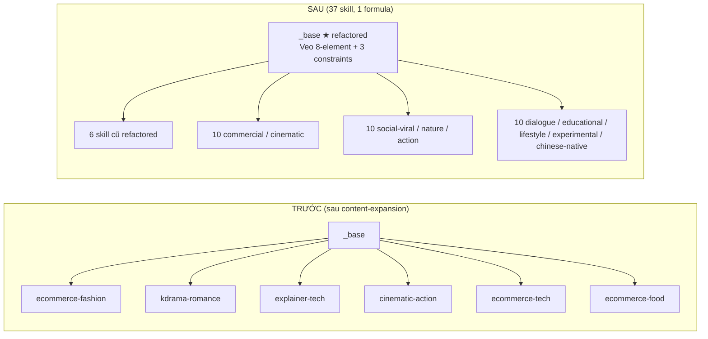
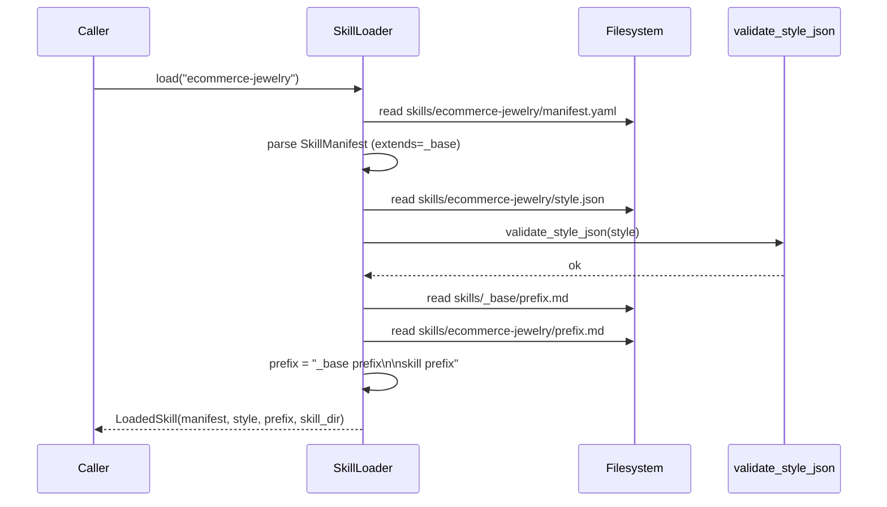

# Design Document — video-variety-expansion

## Overview

`video-variety-expansion` mở rộng số "loại video làm ra" của AIFlow từ **6 → 37 skill** (`_base` + 6 skill refactor + 30 skill mới) bằng cách bổ sung skill data-only mới và refactor skill cũ theo công thức Veo 8-element của Google DeepMind, được battle-tested trong kit `lanshu-awesome-ai-video-kit` (433 prompt × 15 model).

### Nguyên tắc thiết kế

1. **Data-only.** Toàn bộ thay đổi nằm trong `skills/`. Không sửa code Python (ràng buộc R6 của requirements).
2. **Một formula thống nhất.** Mọi skill (`_base`, refactor, mới) cùng dùng Veo 8-element formula trong `prefix.md`. Tránh multi-formula gây phức tạp test và inconsistency.
3. **Tái sử dụng `_base`.** `_base/prefix.md` chứa 8 ô khung Veo + 3 ràng buộc cơ bản (no watermark / logo / subtitle). Mọi skill `extends: _base` thừa hưởng → giảm trùng lặp prefix.
4. **Authoritative pairing.** Mỗi skill khai báo `supported_adapters` chính xác. UI Phase 5 và pipeline orchestrator có thể dựa vào để gating.
5. **Không đụng `video_remaster`.** `video_remaster` là passthrough (output là file video remastered, không qua Veo3); skill phong cách Veo3 không có ý nghĩa với nó (R4.7).

### Nghiên cứu & phát hiện chính (đọc code + lanshu)

- **`SkillLoader.load`** đã ghép `_base/prefix.md` vào trước skill prefix khi `extends: _base` (xem `skill_loader.py:235-241`). Tức là chỉ cần sửa `_base/prefix.md` đúng cách thì 36 skill còn lại tự động thừa hưởng — không cần đụng code merge.
- **`SkillLoader.load`** cũng fall back `style.json` về `_base/style.json` khi skill không khai báo `style_ref` riêng (xem `skill_loader.py:206-221`). Tuy nhiên 30 skill mới đều khai báo `style_ref: style.json` riêng nên nhánh fallback không kích hoạt — mỗi skill tự khai phong cách.
- **`validate_style_json`** chỉ kiểm 3 khoá (`art_style`, `lighting`, `color_palette`). Convention 6 khoá (`+ camera_rules`, `negative_prompts`, `aspect_ratio`) — đã chốt ở R3.11 của content-expansion — phải tự test (giống pattern `test_skills_new.py`).
- **Adapter registry sau `content-expansion`** có 12 adapter_type. Trong đó `video_remaster` là passthrough → loại khỏi pairing. Còn lại 11 adapter chia thành 3 nhóm:

  - **Text-driven** (4): `narrative_script`, `blog_article`, `script_direct`, `epub_novel`.
  - **Asset-driven** (4): `ecommerce_product`, `document_summary`, `photo_slideshow`, `storyboard_manual`.
  - **Audio/feed-driven** (3): `lyric_video`, `news_bulletin`, `podcast_caption`.

- **Lanshu methodology áp được vào skill** (research `methodology/`):

  - **methodology/12 — Veo 8-element formula** → `_base/prefix.md` cấu trúc (Shot framing → Style → Lighting → Character → Location → Action → Dialogue → Audio).
  - **methodology/05 — Camera lexicon** → `style.json.camera_rules` + skill prefix (shot size, motion, lighting type).
  - **methodology/06 — Constraint terms** → `_base/style.json.negative_prompts` + per-skill negative_prompts (3 cơ bản + 2-5 đặc thù).
  - **methodology/08 — 12 pitfalls** → từng pitfall ánh xạ thành 1-2 mục `negative_prompts` (twin/clone, ID drift, style drift, audio cut, watermark, logo).

- **Lanshu data 433 prompt → 30 scenario AIFlow:** dựa trên category distribution thực tế trong `prompts/data/all-prompts.json`:

  | Lanshu category | Count | Skill AIFlow tương ứng |
  |-----------------|-------|----------------------|
  | cinematic (76) | | cinematic-noir, cinematic-drama, cinematic-thriller, cinematic-romance, cinematic-period |
  | action (47) | | action-sports-pov, action-extreme, action-wuxia |
  | product-commercial (40) | | ecommerce-beauty, ecommerce-jewelry, ecommerce-home, product-tech-launch, product-minimal-rotate |
  | nature (22) | | nature-landscape, nature-wildlife, nature-timelapse |
  | social-viral (19) + viral-transform (9) + comedy (8) | | social-viral-hook, social-viral-transform, social-viral-pet-comedy, social-viral-meme |
  | dialogue-driven (16) + dialogue (7) | | dialogue-interview, dialogue-vlog, dialogue-podcast-clip |
  | portrait (10) + lip-sync (2) | | (cover qua dialogue-* + lifestyle-wellness) |
  | quiet-moments (11) + asmr (6) | | experimental-asmr |
  | experimental (7) + creative (32) | | experimental-abstract |
  | chinese-native (3) | | chinese-ink-wash |
  | sports (5) | | (cover qua action-sports-pov, action-extreme) |
  | music-video (3) | | (cover qua lyric_video adapter pairing) |
## Architecture

### Sơ đồ — skill axis trước & sau



### Sơ đồ — skill load chain (không sửa code)



> **Bảo toàn core:** `SkillLoader` đã có sẵn merge logic; spec này chỉ thay đổi nội dung file `_base/prefix.md` và thêm 30 thư mục skill mới. Không sửa code.

### Vị trí file (mọi đường dẫn mới + sửa)

```
app/
├── skills/
│   ├── _base/                           [SỬA] prefix.md + style.json (R1)
│   ├── ecommerce-fashion/               [SỬA] prefix.md/style.json/character.md/scene.md/motion.md/voice.yaml
│   ├── kdrama-romance/                  [SỬA] same
│   ├── explainer-tech/                  [SỬA] same
│   ├── cinematic-action/                [SỬA] same
│   ├── ecommerce-tech/                  [SỬA] same
│   ├── ecommerce-food/                  [SỬA] same
│   │
│   ├── ecommerce-beauty/                [MỚI] 7 file
│   ├── ecommerce-jewelry/               [MỚI]
│   ├── ecommerce-home/                  [MỚI]
│   ├── product-tech-launch/             [MỚI]
│   ├── product-minimal-rotate/          [MỚI]
│   │
│   ├── cinematic-noir/                  [MỚI]
│   ├── cinematic-drama/                 [MỚI]
│   ├── cinematic-thriller/              [MỚI]
│   ├── cinematic-romance/               [MỚI]
│   ├── cinematic-period/                [MỚI]
│   │
│   ├── social-viral-hook/               [MỚI]
│   ├── social-viral-transform/          [MỚI]
│   ├── social-viral-pet-comedy/         [MỚI]
│   ├── social-viral-meme/               [MỚI]
│   │
│   ├── nature-landscape/                [MỚI]
│   ├── nature-wildlife/                 [MỚI]
│   ├── nature-timelapse/                [MỚI]
│   │
│   ├── action-sports-pov/               [MỚI]
│   ├── action-extreme/                  [MỚI]
│   ├── action-wuxia/                    [MỚI]
│   │
│   ├── dialogue-interview/              [MỚI]
│   ├── dialogue-vlog/                   [MỚI]
│   ├── dialogue-podcast-clip/           [MỚI]
│   │
│   ├── explainer-finance/               [MỚI]
│   ├── explainer-history/               [MỚI]
│   │
│   ├── travel-vlog/                     [MỚI]
│   ├── lifestyle-wellness/              [MỚI]
│   │
│   ├── experimental-abstract/           [MỚI]
│   ├── experimental-asmr/               [MỚI]
│   │
│   └── chinese-ink-wash/                [MỚI]
│
└── server/tests/
    ├── test_skills_all.py               [MỚI] parametrize 37 skill
    └── test_skills_pairing.py           [MỚI] adapter pairing assertions
```

> **Bảo toàn core (R6):** không có file `*.py` nào trong `skills/` thay đổi. Không có file nào trong `server/content/` thay đổi.

## Components and Interfaces

Mọi "component" trong spec này là một thư mục skill data-only. Không có Python class hay Protocol mới. Phần này mô tả convention chuẩn hoá cho tất cả skill.

### Component 0: `_base` skill (R1) — refactored

**Vai trò:** foundation prompt + constraint cơ bản cho mọi skill `extends: _base`.

**`_base/manifest.yaml`** — giữ nguyên schema sẵn có (R1.8):

```yaml
name: _base
version: 1.0.0
adapter_type: ""           # base không có adapter cụ thể
style_ref: style.json
camera_lock: true
safety_level: standard
options:
  default_aspect_ratio: "9:16"
  default_fps: 30
  default_camera: static
```

**`_base/prefix.md`** — refactored theo Veo 8-element + 3 constraint cơ bản:

```markdown
# Base prompt — Veo 8-element foundation

## Camera & framing
Locked-off static camera by default. Use deliberate shot framing — establish
shot, medium, close-up, or detail — chosen to serve the beat. No handheld
shake, no dolly, no pan, no tilt unless the scene motion hint explicitly says so.

## Style & lighting
Match the named style of the scene. Name a concrete light source (golden
hour sunlight, neon spill, soft window light, hard key light, overcast,
candlelight, tungsten lamp, fluorescent overhead) — never write "dramatic
lighting" alone.

## Character
Describe the subject before the action: "A mid-30s woman with short dark
hair and a navy coat" — not "A woman walks". Anchor identity early.

## Location
Bind the scene to a real, specific place: "bustling NYC street at noon",
"empty marble bathroom under skylight", "rural ramen stall at twilight".

## Action
One primary action per 8-second clip, resolved cleanly. Multiple micro-motions
must read as a single beat.

## Dialogue (only when relevant)
Keep dialogue under 8 seconds. One or two short lines, on its own line
prefixed `Dialogue:` for Veo3 to parse.

## Audio (always present when relevant)
Layer environmental sound + directional sfx + optional music, on its own
line prefixed `Audio:`. Be specific: not "ambient noise" but "wind through
grass, distant gull cries, soft jazz piano".

## Hard constraints
No watermark. No logo. No subtitle or text overlay. Subjects fully clothed
unless artistic context requires otherwise. Photorealistic or named
illustration style only — no real identifiable persons, no copyrighted
characters, no NSFW content, no weapons.

## Continuity
Maintain consistent lighting direction, color temperature, and background
across consecutive scenes within the same location. When location changes,
introduce a new visual style block but keep it internally consistent.
```

> ≥ 60 từ (yêu cầu R1.3 đạt thừa). Chứa 8 yếu tố Veo, 3 constraint cơ bản, camera lock, continuity rule.

**`_base/style.json`** — bổ sung 6 khoá đầy đủ (R1.4, R1.5):

```json
{
  "art_style": "photorealistic by default; named illustration style when scene declares one",
  "lighting": "natural, named light source; no generic dramatic lighting",
  "color_palette": "scene-driven; consistent across continuity block",
  "camera_rules": "locked-off static; named shot type; one primary motion per clip",
  "negative_prompts": [
    "watermark",
    "logo",
    "text overlay",
    "subtitle",
    "extra limbs",
    "distorted hands",
    "twin / clone of the same person",
    "blurry low-quality output"
  ],
  "aspect_ratio": "9:16"
}
```

> 8 mục `negative_prompts`, gồm 3 cơ bản (R1.5), 5 phòng ngừa pitfall của lanshu (extra limbs, distorted hands, twin, blurry — pitfall #1, #6, #9).

### Component 1: 6 skill cũ — refactored (R2)

Mỗi skill cũ refactor theo cùng template chuẩn dưới đây. Chỉ thay đổi nội dung 7 file dữ liệu; manifest giữ nguyên `adapter_type` để không phá compatibility (R2.1).

**Template `<skill>/prefix.md`** — 40-100 từ, phản ánh ≥ 5 yếu tố Veo (R2.3, R2.4):

```markdown
# <Skill name> — scene prefix

## Style & feel
[Named art style; mood adjectives; reference visual era when relevant]

## Lighting
[Concrete light source; hour of day or quality of light]

## Camera vocabulary for this skill
[Default shot size; allowed motions from Camera_Lexicon — pick 2-3]

## Subject anchoring
[Default character/product framing; identity anchor convention]

## Constraints specific to this skill
[2-5 negative prompts beyond the 3 core constraints from _base]
```

**Template `<skill>/style.json`** — 6 khoá Style_Required_Keys (R2.5, R2.6):

```json
{
  "art_style": "<concrete style description>",
  "lighting": "<concrete lighting description>",
  "color_palette": "<concrete palette description>",
  "camera_rules": "<allowed motions and shot vocabulary>",
  "negative_prompts": [
    "watermark",
    "logo",
    "text overlay",
    "<skill-specific 1>",
    "<skill-specific 2>",
    "<skill-specific 3>",
    "<skill-specific 4>",
    "<skill-specific 5>"
  ],
  "aspect_ratio": "9:16"
}
```

**Template `character.md` / `scene.md` / `motion.md`** — mỗi file ≥ 30 từ và > 1 dòng nội dung (R2.7). Convention nội dung:

- `character.md` — describe default character archetype, identity anchors (face / outfit / accessories), age / gender / styling defaults, "who is in this video by default".
- `scene.md` — beat skeleton (hook → development → resolution), per-beat shot guidance, default location archetype.
- `motion.md` — approved motion vocabulary (from Camera_Lexicon), pacing rules (one primary action per 8s), what to avoid.

**Template `voice.yaml`** (R2.8):

```yaml
voice_profile:
  primary_backend: vieneu | edge_tts
  primary_voice: <voice id>
  fallback_backend: edge_tts
  fallback_voice: <voice id>
  rate: "+0%"
  pitch: "+0%"
  volume: "+0%"
  emotion: natural
  language: vi-VN
```

### Component 2: 30 skill mới (R3)

Mỗi skill mới = một thư mục dưới `skills/<name>/` đủ 7 file theo Skill_Layout_7_File. Tất cả `extends: _base`. Tất cả `style_ref: style.json`. Mỗi `prefix.md` ≥ 60 từ (R3.10) và phản ánh ≥ 5 yếu tố Veo + ≥ 1 keyword camera lexicon (R3.11). `negative_prompts` ≥ 8 mục (R3.13).

Bộ keyword Veo 8-element và camera lexicon mà test sẽ kiểm trên `LoadedSkill.prefix` (sau merge):

```
veo_keywords  = {"shot", "framing", "medium", "close-up", "wide",
                 "lighting", "lit", "light",
                 "audio", "sound", "music",
                 "dialogue", "speaks", "says",
                 "action", "motion",
                 "style", "cinematic", "photorealistic"}

camera_keywords = {"dolly", "pan", "tilt", "tracking", "orbit", "handheld",
                   "gimbal", "steadicam", "rack focus", "slow push-in",
                   "drone", "POV", "static", "locked-off",
                   "golden hour", "blue hour", "overcast", "neon",
                   "soft window light", "hard key light", "backlight",
                   "volumetric"}

constraint_keywords = {"watermark", "logo", "subtitle", "text overlay"}
```

> Test R5.5/R5.6 chỉ cần assert mỗi skill prefix sau merge chứa **ít nhất 1** keyword từ mỗi tập (Veo, camera, constraint) — không yêu cầu tất cả.

### Component 3: Authoritative skill–adapter pairing (R4)

Bảng đầy đủ — đây là **nguồn sự thật** cho `manifest.yaml.supported_adapters` của mỗi skill (R4.4):

| Skill | adapter_type chính | supported_adapters |
|-------|-------------------|--------------------|
| **6 skill cũ refactor** | | |
| `ecommerce-fashion` | `ecommerce_product` | `ecommerce_product`, `storyboard_manual`, `script_direct` |
| `kdrama-romance` | `epub_novel` | `epub_novel` |
| `explainer-tech` | `narrative_script` | `narrative_script`, `blog_article`, `document_summary`, `script_direct` |
| `cinematic-action` | `narrative_script` | `narrative_script`, `storyboard_manual`, `script_direct` |
| `ecommerce-tech` | `ecommerce_product` | `ecommerce_product`, `storyboard_manual`, `script_direct` |
| `ecommerce-food` | `ecommerce_product` | `ecommerce_product`, `storyboard_manual`, `script_direct` |
| **30 skill mới** | | |
| `ecommerce-beauty` | `ecommerce_product` | `ecommerce_product`, `storyboard_manual`, `script_direct` |
| `ecommerce-jewelry` | `ecommerce_product` | `ecommerce_product`, `storyboard_manual`, `script_direct` |
| `ecommerce-home` | `ecommerce_product` | `ecommerce_product`, `storyboard_manual`, `script_direct` |
| `product-tech-launch` | `ecommerce_product` | `ecommerce_product`, `storyboard_manual`, `script_direct`, `narrative_script` |
| `product-minimal-rotate` | `ecommerce_product` | `ecommerce_product`, `script_direct`, `photo_slideshow` |
| `cinematic-noir` | `narrative_script` | `narrative_script`, `storyboard_manual`, `script_direct`, `epub_novel` |
| `cinematic-drama` | `narrative_script` | `narrative_script`, `storyboard_manual`, `script_direct`, `epub_novel` |
| `cinematic-thriller` | `narrative_script` | `narrative_script`, `storyboard_manual`, `script_direct`, `epub_novel` |
| `cinematic-romance` | `narrative_script` | `narrative_script`, `storyboard_manual`, `script_direct`, `epub_novel` |
| `cinematic-period` | `narrative_script` | `narrative_script`, `storyboard_manual`, `script_direct`, `epub_novel` |
| `social-viral-hook` | `narrative_script` | `narrative_script`, `script_direct`, `blog_article`, `news_bulletin` |
| `social-viral-transform` | `narrative_script` | `narrative_script`, `script_direct`, `photo_slideshow` |
| `social-viral-pet-comedy` | `narrative_script` | `narrative_script`, `script_direct`, `photo_slideshow` |
| `social-viral-meme` | `narrative_script` | `narrative_script`, `script_direct` |
| `nature-landscape` | `narrative_script` | `narrative_script`, `script_direct`, `photo_slideshow`, `blog_article` |
| `nature-wildlife` | `narrative_script` | `narrative_script`, `script_direct`, `photo_slideshow`, `blog_article` |
| `nature-timelapse` | `narrative_script` | `narrative_script`, `script_direct`, `photo_slideshow` |
| `action-sports-pov` | `narrative_script` | `narrative_script`, `script_direct`, `storyboard_manual` |
| `action-extreme` | `narrative_script` | `narrative_script`, `script_direct`, `storyboard_manual` |
| `action-wuxia` | `narrative_script` | `narrative_script`, `storyboard_manual`, `script_direct`, `epub_novel` |
| `dialogue-interview` | `narrative_script` | `narrative_script`, `script_direct`, `podcast_caption` |
| `dialogue-vlog` | `narrative_script` | `narrative_script`, `script_direct`, `blog_article` |
| `dialogue-podcast-clip` | `podcast_caption` | `podcast_caption`, `script_direct` |
| `explainer-finance` | `narrative_script` | `narrative_script`, `blog_article`, `document_summary`, `script_direct` |
| `explainer-history` | `narrative_script` | `narrative_script`, `blog_article`, `document_summary`, `script_direct` |
| `travel-vlog` | `narrative_script` | `narrative_script`, `blog_article`, `script_direct`, `photo_slideshow` |
| `lifestyle-wellness` | `narrative_script` | `narrative_script`, `blog_article`, `script_direct`, `photo_slideshow` |
| `experimental-abstract` | `narrative_script` | `narrative_script`, `script_direct`, `lyric_video` |
| `experimental-asmr` | `narrative_script` | `narrative_script`, `script_direct`, `podcast_caption` |
| `chinese-ink-wash` | `narrative_script` | `narrative_script`, `storyboard_manual`, `script_direct`, `epub_novel` |

> **Quy tắc:** Mỗi skill LUÔN có `script_direct` trong `supported_adapters` vì pass-through JSON là đường dẫn nhanh nhất cho user (R4.2 + tiện dụng). `video_remaster` KHÔNG xuất hiện trong bất kỳ hàng nào (R4.7 — passthrough, không sinh clip Veo3).

### Component 4: Skill_Categories (UI/discovery hint, không bắt buộc)

Mỗi skill có thể khai báo `category` trong `manifest.yaml.options` để UI Phase 5 group skills khi hiển thị. Đây là metadata hint, không có acceptance criteria; ai dùng được, ai không bỏ qua được:

```yaml
options:
  category: cinematic       # commercial | cinematic | social-viral | nature
                            # | action | dialogue-driven | educational
                            # | lifestyle | experimental | chinese-native
```

## Data Models

Spec này KHÔNG định nghĩa class hay dataclass mới. Tái dùng:

- `SkillManifest` (`server/content/skill_manifest.py`) — Pydantic, `extra="allow"` nên field tuỳ ý (gồm `extends`, `supported_adapters`, `options.category`) đều chấp nhận.
- `LoadedSkill` (`server/content/skill_loader.py`) — `manifest`, `style`, `prefix`, `skill_dir`.
- `validate_style_json` — kiểm cấu trúc cơ bản 3 khoá; convention 6 khoá là test-side gate.

### `manifest.yaml` của một skill mới (chuẩn) — ví dụ `cinematic-noir`

```yaml
name: cinematic-noir
version: 1.0.0
adapter_type: narrative_script
extends: _base
description: >
  Film-noir style: high-contrast B&W with selective colour, rain-slicked
  streets, neon spill, low-key key light, dramatic shadows. Anchored on a
  single character archetype (PI / suspect / fixer) with terse dialogue.

supported_adapters:
  - narrative_script
  - storyboard_manual
  - script_direct
  - epub_novel

style_ref: style.json
prefix_file: prefix.md
voice: vi-VN-NamMinhNeural

camera_lock: true
safety_level: standard

options:
  default_aspect_ratio: "21:9"
  default_fps: 24
  default_camera: tracking-shot
  category: cinematic
```

### Error Handling

Spec này không định nghĩa error code mới. Errors phát sinh khi load skill xấu là:

| Tình huống | Xử lý | Tầng |
|-----------|-------|------|
| `manifest.yaml` thiếu trường bắt buộc | `SkillLoader.load` raise `ValueError` (đã có) | Skill_Loader |
| `style.json` thiếu 3 khoá lõi | `validate_style_json` trả error → `SkillLoader.load` raise | Skill_Loader |
| `style.json` thiếu 6 khoá convention | Test (`test_skills_all.py`) fail | Test gate |
| `prefix.md` < 60 từ (skill mới) hoặc < 40 từ (skill cũ) | Test fail | Test gate |
| `manifest.adapter_type` không có trong AdapterRegistry | Test fail | Test gate |
| `supported_adapters` trống hoặc thiếu adapter chính | Test fail | Test gate |
| `*.py` file xuất hiện trong skill dir | Test fail | Test gate |
| Tên thư mục ≠ `manifest.name` | Test fail | Test gate |

## Testing Strategy

Spec này thuần data → ngoài property-friendly. Test nằm hoàn toàn ở **example/parametrized** + **smoke**.

### `test_skills_all.py` — parametrize 37 skill (R5)

Pattern (tham khảo `test_skills_new.py` của content-expansion):

```python
ALL_SKILLS = sorted([d.name for d in SKILLS_DIR.iterdir()
                     if d.is_dir() and not d.name.startswith(".")])

NEW_30_SKILLS = {  # exact set required by R3
    "ecommerce-beauty", "ecommerce-jewelry", "ecommerce-home",
    "product-tech-launch", "product-minimal-rotate",
    "cinematic-noir", "cinematic-drama", "cinematic-thriller",
    "cinematic-romance", "cinematic-period",
    "social-viral-hook", "social-viral-transform",
    "social-viral-pet-comedy", "social-viral-meme",
    "nature-landscape", "nature-wildlife", "nature-timelapse",
    "action-sports-pov", "action-extreme", "action-wuxia",
    "dialogue-interview", "dialogue-vlog", "dialogue-podcast-clip",
    "explainer-finance", "explainer-history",
    "travel-vlog", "lifestyle-wellness",
    "experimental-abstract", "experimental-asmr",
    "chinese-ink-wash",
}
LEGACY_6_SKILLS = {
    "ecommerce-fashion", "kdrama-romance", "explainer-tech",
    "cinematic-action", "ecommerce-tech", "ecommerce-food",
}

VEO_KEYWORDS = {...}
CAMERA_KEYWORDS = {...}
CONSTRAINT_KEYWORDS = {"watermark", "logo", "subtitle", "text overlay"}

@pytest.mark.parametrize("skill_name", sorted(NEW_30_SKILLS | LEGACY_6_SKILLS | {"_base"}))
def test_skill_validates_cleanly(skill_name): ...

@pytest.mark.parametrize("skill_name", sorted(NEW_30_SKILLS | LEGACY_6_SKILLS))
def test_skill_loads_with_valid_style(skill_name): ...

@pytest.mark.parametrize("skill_name", sorted(NEW_30_SKILLS | LEGACY_6_SKILLS))
def test_skill_seven_file_layout(skill_name): ...

@pytest.mark.parametrize("skill_name", sorted(NEW_30_SKILLS | LEGACY_6_SKILLS))
def test_skill_no_python_files(skill_name): ...

@pytest.mark.parametrize("skill_name", sorted(NEW_30_SKILLS))
def test_new_skill_prefix_word_count_ge_60(skill_name): ...

@pytest.mark.parametrize("skill_name", sorted(LEGACY_6_SKILLS))
def test_legacy_skill_prefix_word_count_ge_40(skill_name): ...

@pytest.mark.parametrize("skill_name", sorted(NEW_30_SKILLS | LEGACY_6_SKILLS))
def test_skill_style_has_six_keys(skill_name): ...

@pytest.mark.parametrize("skill_name", sorted(NEW_30_SKILLS | LEGACY_6_SKILLS))
def test_skill_negative_prompts_min_eight(skill_name): ...

@pytest.mark.parametrize("skill_name", sorted(NEW_30_SKILLS | LEGACY_6_SKILLS))
def test_skill_loaded_prefix_has_constraint_keywords(skill_name): ...

@pytest.mark.parametrize("skill_name", sorted(NEW_30_SKILLS | LEGACY_6_SKILLS))
def test_skill_loaded_prefix_has_camera_keyword(skill_name): ...

@pytest.mark.parametrize("skill_name", sorted(NEW_30_SKILLS | LEGACY_6_SKILLS))
def test_skill_name_matches_directory(skill_name): ...

@pytest.mark.parametrize("skill_name", sorted(NEW_30_SKILLS | LEGACY_6_SKILLS))
def test_skill_template_files_substantive(skill_name): ...

@pytest.mark.parametrize("skill_name", sorted(NEW_30_SKILLS | LEGACY_6_SKILLS))
def test_skill_voice_yaml_complete(skill_name): ...

def test_required_30_skills_complete(): ...
def test_no_extra_skills_outside_known_sets(): ...   # tripwire
```

### `test_skills_pairing.py` — adapter pairing assertions (R4)

```python
@pytest.fixture(scope="module")
def registry():
    reg = AdapterRegistry()
    reg.auto_discover("server.content.adapters")
    return reg

@pytest.mark.parametrize("skill_name", sorted(NEW_30_SKILLS | LEGACY_6_SKILLS))
def test_adapter_type_is_registered(registry, skill_name): ...

@pytest.mark.parametrize("skill_name", sorted(NEW_30_SKILLS | LEGACY_6_SKILLS))
def test_supported_adapters_all_registered(registry, skill_name): ...

@pytest.mark.parametrize("skill_name", sorted(NEW_30_SKILLS | LEGACY_6_SKILLS))
def test_adapter_type_is_in_supported_adapters(skill_name): ...

@pytest.mark.parametrize("skill_name", sorted(NEW_30_SKILLS | LEGACY_6_SKILLS))
def test_video_remaster_not_in_supported_adapters(skill_name): ...
```

### Smoke + tripwire

- **Tripwire** ở `test_skills_all.py`: `test_no_extra_skills_outside_known_sets` đảm bảo `NEW_30_SKILLS ∪ LEGACY_6_SKILLS ∪ {"_base"}` đúng bằng tập thư mục thật trong `skills/`. Nếu ai lén thêm thư mục skill mà không update spec, test fail rõ ràng.
- **Tripwire ở core preservation**: Bổ sung 1 test trong `test_skills_pairing.py` (`test_no_changes_to_skill_loader_core`) — assert `SkillLoader` vẫn có các method `load`, `validate_skill`, `list_skills` (giống pattern R6 tripwire của content-expansion).

### Phạm vi không cần test

- Không kiểm word-count cho `_base/prefix.md` (R1.3 đặt mức ≥ 60 thực ra đã đạt thừa nếu copy template).
- Không kiểm prefix có Veo 8-element keyword **đầy đủ** trên file gốc — chỉ kiểm sau merge có **ít nhất 1** keyword từ Veo / camera / constraint set (đó là cách đo "thực sự áp formula", không phải "kể đủ tên 8 yếu tố").
- Không integration test với Veo3 thật (out-of-scope; Veo3 thật cần token Flow).

### Heavy / opt-in tests

Không có. Spec này hoàn toàn structural.

## Mapping requirement → component → test

| Requirement | Component | Test file |
|-------------|-----------|-----------|
| R1 (`_base` refactor) | C0 | `test_skills_all.py::test_skill_validates_cleanly[_base]` + visual review |
| R2 (6 skill cũ refactor) | C1 | `test_skills_all.py` parametrize subset `LEGACY_6_SKILLS` |
| R3 (30 skill mới) | C2 | `test_skills_all.py` parametrize subset `NEW_30_SKILLS` + `test_required_30_skills_complete` |
| R4 (pairing) | C3 | `test_skills_pairing.py` toàn bộ |
| R5 (test bao phủ) | — | `test_skills_all.py` + `test_skills_pairing.py` |
| R6 (bảo toàn core) | — | `test_skills_pairing.py::test_no_changes_to_skill_loader_core` + tripwire |